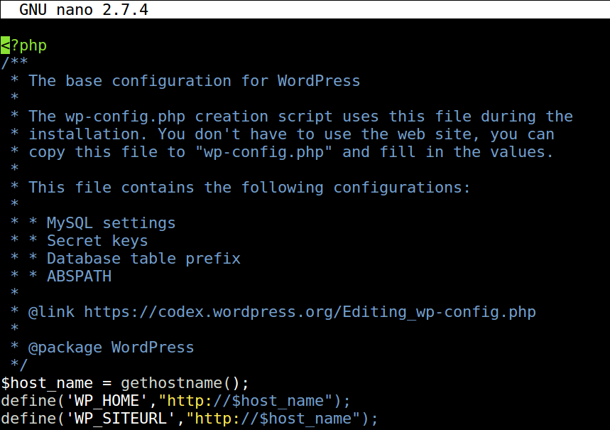

# Wordpress configurations

### wp-config.php

#### Update wordpress IP address automatically:



`/var/www/html/wp-config.php`

Add:
```
$host_name = gethostname();
define('WP_HOME',"http://$host_name");
define('WP_SITEURL',"http://$host_name");
```

to same location as in the image above.
